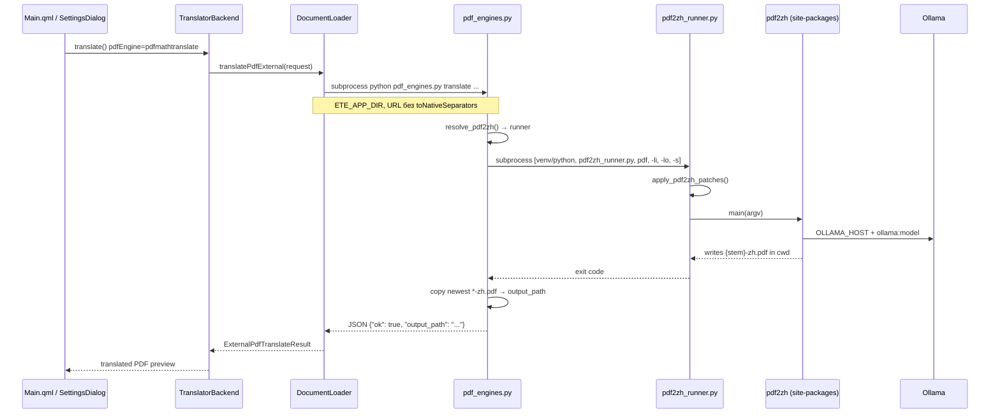

# 02 — Архитектура

## Диаграмма вызовов (pdfmathtranslate)



## Переменные окружения

| Переменная | Кто выставляет | Назначение |
|------------|----------------|------------|
| `ETE_APP_DIR` | `document_loader.cpp` → `runProcess` | Корень exe; поиск `tools/`, `engines/` |
| `OLLAMA_HOST` | `pdf_engines.py` | Базовый URL Ollama (нормализованный) |
| `OLLAMA_MODEL` | `pdf_engines.py` | Имя модели (дублирует `-s`) |
| `PYTHONIOENCODING` / `PYTHONUTF8` | C++ + Python | UTF-8 для subprocess |
| `HF_HUB_DISABLE_SYMLINKS_WARNING` | `pdf_engines.py` | Подавление предупреждения HF |

## Разрешение pdf2zh (`resolve_pdf2zh`)

Приоритет:

1. **`[sys.executable, pdf2zh_runner.py]`** — если `importlib.find_spec("pdf2zh")` OK  
2. **`engines/pdf2zh/pdf2zh.exe`** — portable bundle  
3. **`pdf2zh` в PATH** — снова runner, если доступен  
4. Иначе — недоступен (probe `available: false`)

## Пути и cwd

- **Входной PDF**: абсолютный путь в аргументе.
- **cwd subprocess pdf2zh**: каталог **выходного** PDF (`output_path.parent`).
- **Итог**: `pdf_engines.py` ищет `{input_stem}-zh.pdf` (или `-mono`, `-dual`) и копирует в `output_path`.

## Probe (статус в настройках)

```
AppSettings::probePdfEnginesStatus()
  → DocumentLoader::probePdfEngines()
  → python tools/pdf_engines.py probe --engine all
  → JSON engines.{etemenanki|pdfmathtranslate}
```

## Python interpreter

- Файл `build/Release/tools/python_path.txt` → `.venv/Scripts/python.exe` (CMake post-build).
- `DocumentLoader::resolvePythonPath()` читает его при старте.

## Критичные места для ревью

1. **`runPythonScript`**: не применять `QDir::toNativeSeparators` к `http://` URL (ломает Ollama).
2. **`normalizeOllamaUrl`**: замена `\` → `/`, префикс `http://`.
3. **`pdf_engines.normalize_ollama_url`**: дублирующая защита на стороне Python.
4. **Таймаут перевода**: 7200 с в `translatePdfExternal`.
